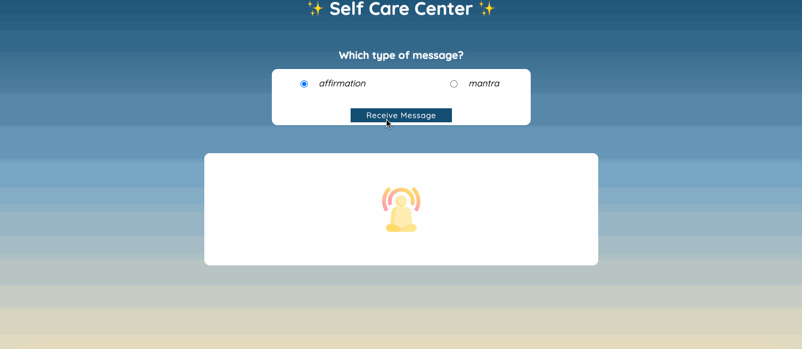

# Self-Care Center 

### Abstract:
This is an app that displays either an affirmation or mantra, depending on the user's selection. It is a motivational app that helps people when they need self-care.

### Installation Instructions:
1. Clone down the Self Care Center repositry from GitHub.
2. Run `open index.html` from your computer's Terminal application inside the repository.

### Preview of App:

### Context:
This is my Mod 1 Solo Challenge for my time at Turing School for Software and Design. I had one week to work on it, and was able to implement
the error handling and clear form functionality.

### Contributors:
- Ben Rosner [Link to GitHub](https://github.com/ben-rosner-williamsburg)

### Learning Goals:
- Gain experience building an application that utilizes HTML, CSS and JavaScript
- Write HTML and CSS to match a provided comp
- Understand how to listen to and respond to user events
- Individualize your programming skill set

### Wins + Challenges:
- Win: Coding an entire project in HTML, CSS and JavaScript by myself!
- Challenge: Figuring out how to add the image back to the image container once the Clear Form button is pressed.
- Win: Figuring out how to position elements with flexbox, which in the past has been a big challenge. Scott's lesson
really helped with this.
- Win: Feeling more confident about my code than I ever have before.